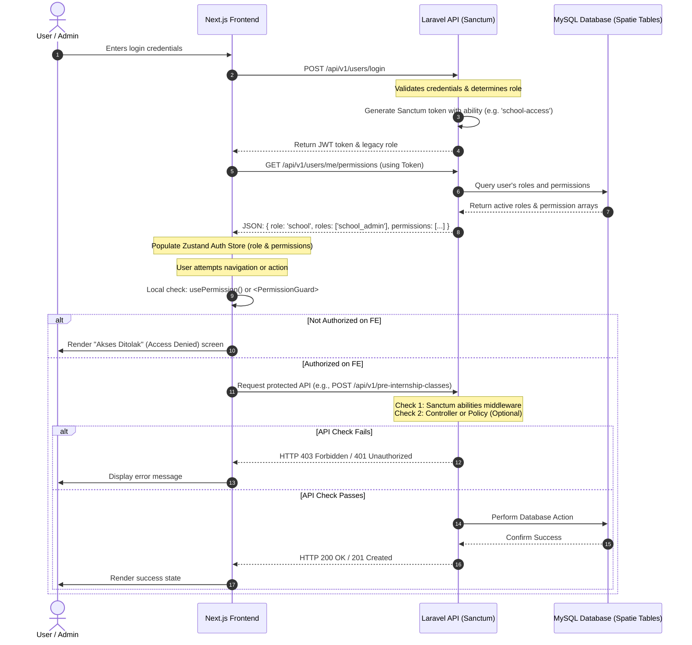

# Role and Permission System Workflow

This document explains the full end-to-end architecture and workflow of the **Role-Based Access Control (RBAC)** system implemented in the Prakerin platform.

---

## 1. High-Level Architecture Flow

The system employs a dual-layered security checkpoint:
1. **Coarse-Grained Layer (Token-Based):** Handled by Laravel Sanctum token abilities (`admin-access`, `school-access`, `student-access`, `company-access`) mapping to overall portal views.
2. **Fine-Grained Layer (Role/Permission-Based):** Handled by the Spatie Laravel Permission package, which maps specific atomic permissions (e.g., `create_kelas`, `view_laporan`) to roles, and assigns those roles to users.

### Lifecycle Diagram



---

## 2. Database & Seeding Layer (Backend)

The backend uses the [Spatie Laravel Permission](https://spatie.be/docs/laravel-permission/v6/introduction) package under the hood. All roles and permissions are defined with the `sanctum` guard.

### Seeding Configuration
In [RolePermissionSeeder.php](file:///c:/laragon/www/Prakerin-BE/database/seeders/RolePermissionSeeder.php):
- **Permissions List:** Defined as strings following the `[action]_[feature]` format (e.g., `view_kelas`, `create_kelas`, `delete_kelas`, `view_pembimbing`).
- **Role Assignments:** Pre-mapped role groups, such as:
  - `siswa`: `view_dashboard`, `view_kelas`, `view_pembimbing`, `view_panduan`, `view_feedback`, `view_profil`, `edit_profil`, `view_ai_analytics`.
  - `school_admin`: Full CRUD for classes, mentors, guidelines, management of school users, feedback approvals, reports, and activity logs.
  - `super_admin`: Full access to all permissions, including special permissions like `manage_roles` and `manage_permissions`.

### Legacy Role Mapping
To maintain compatibility with legacy database fields, the [User](file:///c:/laragon/www/Prakerin-BE/app/Models/User.php) model maps legacy string roles (`role` column) + metadata into Spatie Roles:

| Legacy `role` Column | School/Student Type | Resolved Spatie Role (`sanctum` guard) |
| :--- | :--- | :--- |
| `super_admin` | *N/A* | `super_admin` |
| `company` | *N/A* | `company_owner` |
| `school` | `school` | `school_admin` |
| `school` | `university` / *null* | `university_admin` |
| `student` | `school` | `siswa` |
| `student` | `university` / *null* | `mahasiswa` |

This resolve logic is executed by [User::resolveSpatieRoleName](file:///c:/laragon/www/Prakerin-BE/app/Models/User.php#L64) and kept in sync via [User::syncSpatieRole](file:///c:/laragon/www/Prakerin-BE/app/Models/User.php#L80).

---

## 3. How the Feature Checks Permissions

### Step A: API Access Verification (Backend Routing)
In [routes/api.php](file:///c:/laragon/www/Prakerin-BE/routes/api.php), routes are structured under group middleware:
- Token-level boundaries are enforced by Sanctum's `abilities` or `ability` middleware configured in [bootstrap/app.php](file:///c:/laragon/www/Prakerin-BE/bootstrap/app.php):
  ```php
  // Only accessible by school administrators or university administrators
  Route::middleware('abilities:school-access')->group(function () {
      Route::get('/student/summary', 'studentSummary');
  });
  ```
- If a user sends a request without the required token ability, the framework throws an `AccessDeniedHttpException` or returns an `Unauthorized` response.

### Step B: Fetching the Context (Login/Initialization)
1. Upon successful login in the frontend page [masuk/page.tsx](file:///c:/laragon/www/Prakerin-FE/src/app/masuk/page.tsx#L84), the application requests the current user permissions:
   ```typescript
   const permsData = await getUserPermissions(response.data.token);
   ```
2. The backend responds via [UserController::myPermissions](file:///c:/laragon/www/Prakerin-BE/app/Http/Controllers/UserController.php#L913) (`GET /api/v1/users/me/permissions`):
   ```json
   {
     "data": {
       "role": "school",
       "roles": ["school_admin"],
       "permissions": ["view_dashboard", "view_kelas", "create_kelas"]
     }
   }
   ```
3. The frontend stores this role and permission array in the Zustand store [authStore.ts](file:///c:/laragon/www/Prakerin-FE/src/stores/authStore.ts) using `setRole` and `setPermissions`.

### Step C: UI Guarding (Frontend Verification)
The frontend utilizes two primary features for verification:
1. **Hook: [usePermission()](file:///c:/laragon/www/Prakerin-FE/src/hooks/usePermission.ts)**
   Exposes helper methods like `can()`, `canAny()`, `canAll()`, and `hasRole()`:
   ```typescript
   const { can } = usePermission();
   if (can('create_kelas')) {
       // Show add button
   }
   ```
2. **Component: [PermissionGuard](file:///c:/laragon/www/Prakerin-FE/src/components/PermissionGuard.tsx)**
   Wraps components or pages to prevent unauthorized entry:
   ```tsx
   <PermissionGuard permission="manage_permissions">
       <RolesPermissionsContent />
   </PermissionGuard>
   ```
   *Note: If the logged-in user has the `super_admin` role, permission checks are automatically bypassed (`role === 'super_admin' || can(permission)`).*

---

## 4. How Admins Grant/Revoke Permissions

Super Admins can dynamically add or remove permissions assigned to specific Spatie Roles via the dashboard.

### Step 1: Admin Interaction in UI
- The administrator navigates to `/dashboard/master-data/roles` handled by [roles/page.tsx](file:///c:/laragon/www/Prakerin-FE/src/app/dashboard/master-data/roles/page.tsx).
- The page groups all available system permissions logically (e.g. Class Management, Mentor Management, User Management, Reports).
- When the administrator toggles checkbox values for a chosen role, the client maps the updated list of strings.

### Step 2: API Call
- The UI triggers [updateRolePermissions](file:///c:/laragon/www/Prakerin-FE/src/libs/permissionApi.ts#L77) in the frontend calling the backend API:
  `PUT /api/v1/system/roles/{roleName}/permissions`
  Payload:
  ```json
  {
    "permissions": ["view_dashboard", "view_kelas", "create_kelas", "edit_kelas"]
  }
  ```

### Step 3: Backend Synchronization & Cache Invalidation
The request is captured by [RolePermissionController::updateRolePermissions](file:///c:/laragon/www/Prakerin-BE/app/Http/Controllers/RolePermissionController.php#L45):
```php
public function updateRolePermissions(Request $request, string $roleName)
{
    $request->validate([
        'permissions' => 'required|array',
        'permissions.*' => 'string|exists:auth_permissions,name',
    ]);

    $role = Role::where('name', $roleName)->firstOrFail();

    // 1. Sync permissions inside database
    $role->syncPermissions($request->input('permissions'));

    // 2. Clear Spatie's permission registrar cache
    app()[PermissionRegistrar::class]->forgetCachedPermissions();

    return response()->json([
        'message' => "Permissions for role '{$roleName}' updated successfully.",
        'data' => [
            'role' => $role->name,
            'permissions' => $role->permissions()->pluck('name'),
        ]
    ], 200);
}
```

By calling `forgetCachedPermissions()`, Spatie forces Laravel to reload user authorization parameters directly from the DB on subsequent requests, meaning:
- **Instant Effect:** All active users belonging to the updated role immediately experience the change on their next backend endpoint request.
- **Frontend Sync:** When the user reloads the page or accesses the app, the frontend fetches the fresh permission set from the backend and updates the client-side authentication context immediately.
